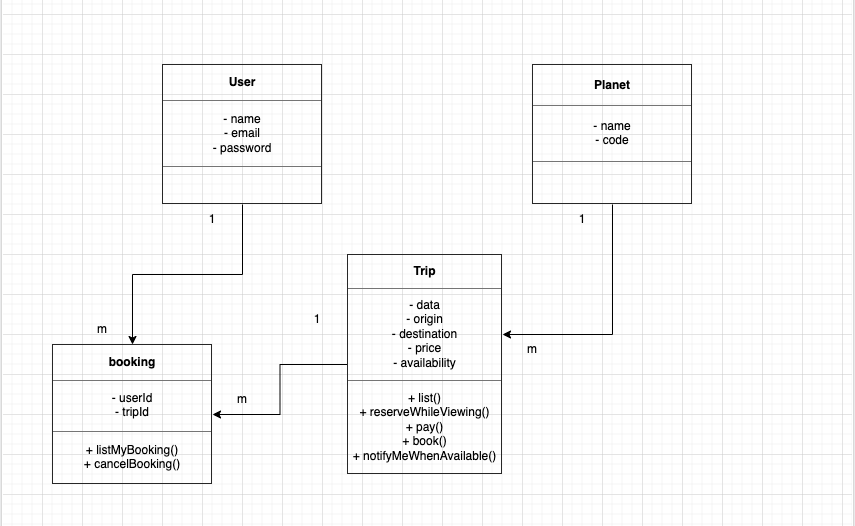

# Project Setup
## Installing Dependencies

`npm ci`

## Running The Project
### Terminal 1
`export STRIPE_SECRET_KEY=<secret key> && npm run server`

Runs the server on port `4242` (needed for payment to work).
### Terminal 2
`npm start`

Runs the app in the development mode.\
Open [http://localhost:3000](http://localhost:3000) to view it in the browser.

## Dummy credit cards to test the payment
Payment succeeds&nbsp;&nbsp;&nbsp;&nbsp;&nbsp;&nbsp;&nbsp;&nbsp;&nbsp;&nbsp;&nbsp;&nbsp;&nbsp;&nbsp;&nbsp;&nbsp;&nbsp;&nbsp;&nbsp;&nbsp;&nbsp;&nbsp;&nbsp;&nbsp;&nbsp; `4242 4242 4242 4242`\
Payment requires authentication&nbsp;&nbsp; `4000 0025 0000 3155`\
Payment is declined &nbsp;&nbsp;&nbsp;&nbsp;&nbsp;&nbsp;&nbsp;&nbsp;&nbsp;&nbsp;&nbsp;&nbsp;&nbsp;&nbsp;&nbsp;&nbsp;&nbsp;&nbsp;&nbsp;&nbsp;&nbsp;&nbsp;&nbsp;`4000 0000 0000 9995`

## Project UML
